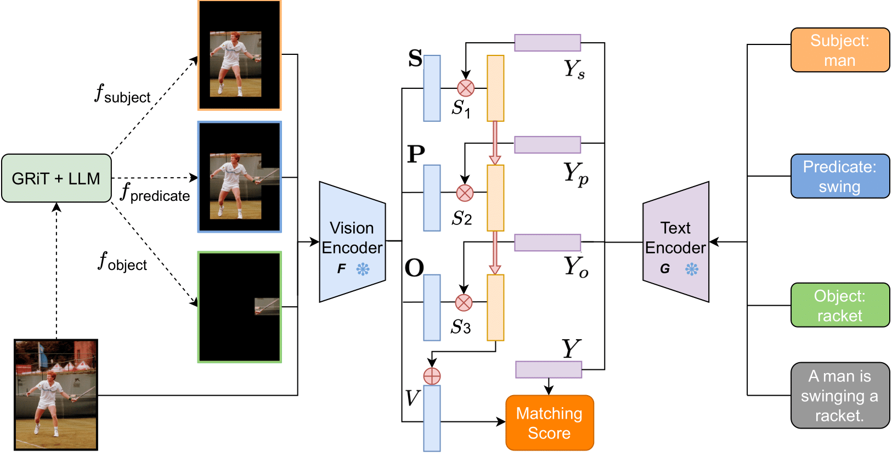

## ComCLIP: Training-Free Compositional Image and Text Matching

This is the code implementation for the NAACL2024 paper: "ComCLIP: Training-Free Compositional Image and Text Matching" [[Arxiv](https://arxiv.org/abs/2211.13854)][[Project Website](https://sites.google.com/view/comclip)]

<div align=center>  

</div>


## Datasets
Please follow the instructions below to prepare the datasets.
1. Winoground <br/>
[Download images](https://huggingface.co/datasets/facebook/winoground/tree/main/data) and store them as `datasets/winoground_images`. Code includes the download of csv file.
2. Compositional Visual Genome (ComVG) <br/>
[Download images](https://homes.cs.washington.edu/~ranjay/visualgenome/api.html) and store them as `datasets/comvg_images`. [Test csv file](https://drive.google.com/file/d/1rWHuq48paToXZs7_OT2Wko4l5YrAfFmR/edit) at at `datasets/ComVG.csv`
3. SVO-Probe<br/>
[Download dataset](https://github.com/google-deepmind/svo_probes/blob/main/svo_probes.csv) and store the images as `datasets/SVO-Probes`. Store csv as `datasets/svo-probes.csv`
4. Flickr30k<br/>
[Download images](https://shannon.cs.illinois.edu/DenotationGraph/) and store them as `datasets/flickr30k_image` (Please only select images that are in the test sets). Test pickle file is `datasets/flickr30k_test.pkl`. 

## Usage 
### Preparation 
Please follow [GRiT and detectron2 Setup](https://github.com/JialianW/GRiT/blob/master/docs/INSTALL.md) and [CLIP Setup](https://github.com/openai/CLIP/tree/main) first.
Download [grit_b_densecap_objectdet.pth](https://github.com/JialianW/GRiT/tree/master#object-detection-on-coco-2017-dataset) and store it in `GRiT/models`.
Please follow [SLIP](https://github.com/facebookresearch/SLIP#vit-large) and download ViT-L weights in `SLIP/MODEL_PATH`
<pre>conda create --name comclip python=3.10
conda activate comclip
pip install -r requirements.txt
pip install git+https://github.com/openai/CLIP.git
</pre>

### Winoground
<pre>### clip baseline
python winoground/clip_baseline.py --huggingface_token HUGGINGFACE_TOKEN
### blip baseline
python winoground/blip_baseline.py --huggingface_token HUGGINGFACE_TOKEN
### slip baseline
python winoground/slip_baseline.py --huggingface_token HUGGINGFACE_TOKEN

### comclip 
winoground/comclip.sh datasets/winoground_images DENSE_CAPTION_PATH PARSE_TEXT_PATH GRiT_MODEL HUGGINGFACE_KEY OPENAI_KEY
### comblip
winoground/comclip.sh datasets/winoground_images DENSE_CAPTION_PATH PARSE_TEXT_PATH GRiT_MODEL HUGGINGFACE_KEY OPENAI_KEY
### comslip
winoground/comslip.sh datasets/winoground_images DENSE_CAPTION_PATH PARSE_TEXT_PATH GRiT_MODEL HUGGINGFACE_KEY OPENAI_KEY
</pre>

### ComVG & SVO-Probes
<pre>
### clip baseline
python ComVG/clip_baseline.py --model ViT-L/14 --data_path datasets/ComVG.csv --image_path datasets/comvg_images
### comclip 
ComVG/comclip.sh datasets/comvg_images DENSE_CAPTION_PATH GRiT_MODEL_PATH datasets/ComVG.csv OPENAI_KEY ViT-L/14
</pre>

### Flick30k (image retrieval)
<pre>
### clip baseline (precompted in datasets/flickr30k_test.pkl already)
python image_retrieval/clip_baseline.py --model VISION_ENCODER_TYPE --dataset datasets/flickr30k_test.pkl --image_path datasets/flickr30k_image
### comclip 
image_retrieval/comclip.sh datasets/flickr30k_image DENSE_CAPTION_FOLDER GRiT_MODEL_PATH datasets/flickr30k_test.pkl OPENAI_KEY VISION_ENCODER_VERSION
</pre>

## Acknowledgement 
This code is mainly built on 1.[GRiT](https://github.com/JialianW/GRiT) 2.[CLIP](https://github.com/openai/CLIP).
We thank the authors for their model and code.

## Citation
```bibtex
@article{jiang2022comclip,
  title={Comclip: Training-free compositional image and text matching},
  author={Jiang, Kenan and He, Xuehai and Xu, Ruize and Wang, Xin Eric},
  journal={arXiv preprint arXiv:2211.13854},
  year={2022}
}
```
